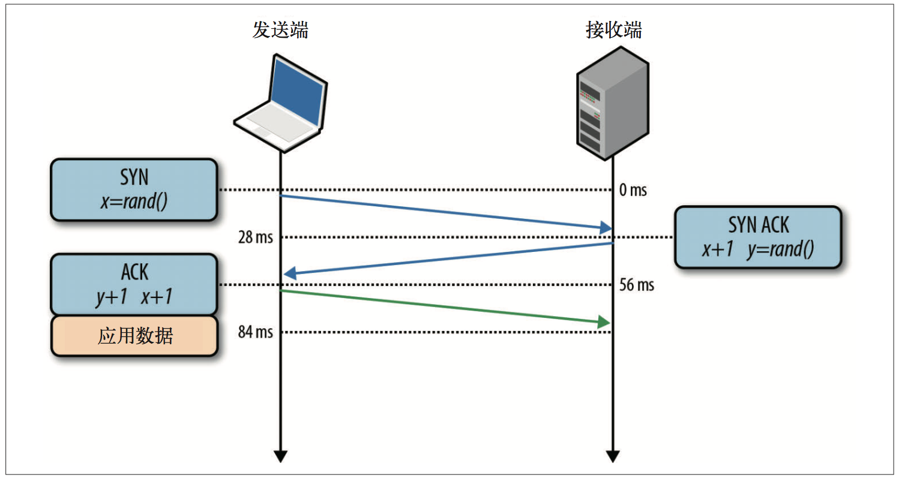
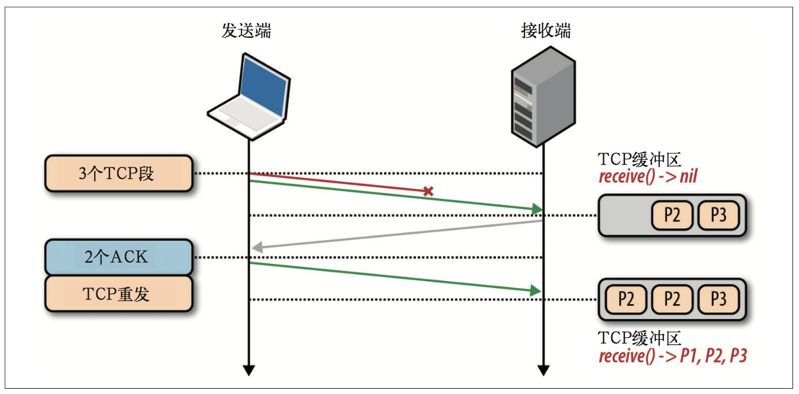

*本文大部分内容摘自《Web性能权威指南》，然后经过本人的整理修饰，产生了本文，仅供学习所用。*

## 开始
我们做为一名互联网时代的开发，由于各种信息、知识的开源与共享，想要开发出一款可用网络应用已经相当容易了，但是想要开发出一款“快速”访问网络的应用，却并不是那么简单，需要经过无数的优化，踩过无数的坑才能更“快”。然而，如果对网络背后的原理都半点不知，又从何谈起优化，更不用说动手去优化。说到网络协议，我们自然而然会想到TCP/IP协议，因为它已经成了我们日常的一部分，只是因为它对绝大部分人来说都是透明的，看不见它。可是想要提高我们的网络应用的访问速度，却不得不揭开它的面纱，一窥其芳容。想要全面的了解它并不是一早一夕的事，我们只能先从出它的一些共性入手，下面便让我们一起看看到底TCP/IP是何物，又该如何让TCP更快一些。

## 什么是TCP、IP
- **IP**，即 Internet Protocol(因特网协议)，位于网络层，负责联网主机之间的路由选择和寻址;
- **TCP**，即 Transmission Control Protocol(传输控制协议)，位于传输层，负责在不可靠的传输信道之上提供可靠的抽象层。

	> TCP 负责在不可靠的传输信道之上提供可靠的抽象层，向应用层隐藏了大多数网络通信的复杂细节，比如丢包重发、按序发送、拥塞控制及避免、数据完整，等等。 采用TCP数据流可以确保发送的所有字节能够完整地被接收到，而且到达客户端的顺序也一样。也就是说，TCP 专门为精确传送做了优化，但并未过多顾及时间。

## 是什么给TCP带来了网络延迟
众所周知，在现代的网络应用中我们几乎离不开TCP，从浏览器到微信，无一例外。但，我们在享受TCP给我们带来的便利的同时，却又对其所带来的网络延迟感到煎熬，总是尝试去改善它，那么究竟是什么给TCP带来了不小的网络延迟呢？下面便列举几种常见的因素。

### TCP的3次握手
所有TCP连接一开始都要经过3次握手，如下图。

3次握手的过程如下：

- SYN
客户端选择一个随机序列号x，并发送一个SYN分组，其中可能还包括其他TCP标志和选项。
- SYN ACK
服务器给x加1，并选择自己的一个随机序列号y，追加自己的标志和选项，然后返回响应。
- ACK
客户端给x和y加1并发送握手期间的最后一个ACK分组。

经过上面的3次握手之后，客户端与服务端就可以通信了。**客户端在发送完ACK分组数据之后，可以马上发送数据，而服务端必须等接收到了ACK分组数据才能发送数据**。可见，3次握手带来的延迟使得每创建一个新TCP连接都要付出很大代价。而这也决定了提高TCP应用性能的关键，在于想办法**重用连接**。

### TCP的流量控制
流量控制是一种预防发送端过多向接收端发送数据的机制。否则，接收端可能因为忙碌、负载重或缓冲区既定而无法处理。为实现流量控制，TCP连接的每一方都要通告接收方自己的**接收窗口(rwnd)**，其中包含能够保存数据的**缓冲区空间大小信息**。

如果其中一端跟不上数据传输，那它可以向发送端通告一个较小的窗口。 假如窗口为零，则意味着必须由应用层先清空缓冲区，才能再接收剩余数据。**这个过程贯穿于每个TCP连接的整个生命周期:如上图，每个ACK分组都会携带相应的最新rwnd值，以便两端动态调整数据流速，使之适应发送端和接收端的容量及处理能力**。

### TCP的慢启动
发送端和接收端在连接建立之初，谁也不知道可用带宽是多少，因此需要一个估算机制，然后还要根据网络中不断变化的条件 而动态改变速度。

比如：在家中开始以宽带全速8M/s的速度观看在线视频，中途有人更新软件，此时视频的下载速度根本达不到8M/s，如果依然以原来的速度传输，那么数据很快就会在某个中间的网关越积越多，最终会导致分组被删除，从而降低网络传输效率。

慢启动就是用来应对这种问题的方案。首先通信的发送端会初始化一个叫做**拥塞窗口(cwnd)**的变量，其值就是在收到对方ACK之前可以发送数据大小，并且是一个保守的值。发送端最大可以传输(未经ACK确认的)数据量取`rwnd`和`cwnd`变量中的最小值。在接下来得发送过程中，每收到一个ACK（未收到则等待），发送数据量就以指数增长的方式往上增加，直到超过接收端的流量控制窗口`rwnd`，即系统配置的拥塞阈值(ssthresh)窗口，或者有分组丢失为止，此时拥塞预防算法介入。**由此可见在TCP三次握手到达最大传输速度之间会有一段慢启动导致的耗时**。减少慢启动导致的耗时的方案有：

- **减少通信双方的往返时间**。（比如选择就近的服务器向客户端发送数据）
- **加大初始拥塞窗口(cwnd)的值**。（一般这个值是伴随着系统版本而更新的）

### TCP的拥塞预防
拥塞预防算法把丢包作为网络拥塞的标志，即路径中某个连接或路由器已经拥堵了， 以至于必须采取删包措施。因此，必须调整窗口大小，以避免造成更多的包丢失，从而保证网络畅通。

重置拥塞窗口后，拥塞预防机制按照自己的算法来增大窗口以尽量避免丢包。某个时刻，可能又会有包丢失，于是这个过程再从头开始。如果你看到过TCP连接的吞吐量跟踪曲线，发现该曲线呈锯齿状，那现在就该明白为什么了。这是拥塞控制和预防算法在调整拥塞窗口，进而消除网络中的丢包问题。

### 队首阻塞
TCP在不可靠的信道上实现了可靠的网络传输。基本的分组错误检测与纠正、按序交付、丢包重发，以及保证网络最高效率的流量控制、拥塞控制和预防机制，让TCP成为大多数网络应用中最常见的传输协议。

每个TCP分组都会带着一个唯一的序列号被发出，而所有分组必须按顺序传送到接收端(如下图)。如果中途有一个分组没能到达接收端，那么后续分组必须保存在接收端的TCP缓冲区，等待丢失的分组重发并到达接收端。这一切都发生在TCP层，应用程序对TCP重发和缓冲区中排队的分组一无所知，必须等待分组全部到达才能访问数据。在此之前，应用程序只能在通过套接字读数据时感觉到延迟交付。这种效应称为TCP的**队首(HOL，Head of Line)阻塞**。

## 怎么让TCP网络延迟小一些
TCP是一个自适应的、对所有网络节点一视同仁的、最大限制利用底层网络的协议。因此，优化TCP的**最佳途径就是调整它感知当前网络状况的方式**，根据它之上或之下的抽象层的类型和需求来改变它的行为。无线网络可能需要不同的拥塞算法，**而某些应用程序可能需要自定义服务品质(QoS，Quality of Service)的含义**，从而 交付最佳的体验。

上面只蜻蜓点水般地介绍了影响TCP性能的几个典型因素，而没有探讨的选择性应答(SACK)、延迟应答、快速转发等，随 便一个都能让你领略到 TCP 的复杂性(或者乐趣)，感受到理解、分析和调优之难。

尽管如此，而且每个算法和反馈机制的具体细节可能会继续发展，但核心原理以及它们的影响是不变的:

- TCP三次握手增加了整整一次往返时间。
- TCP慢启动将被应用到每个新连接。
- TCP流量及拥塞控制会影响所有连接的吞吐量。
- TCP的吞吐量由当前拥塞窗口大小控制。

### 服务器配置调优

- **增大TCP的初始拥塞窗口。**
- **在连接空闲时禁用慢启动可以改善瞬时发送数据的长TCP连接的性能。**
- **启用窗口缩放可以增大最大接收窗口大小，可以让高延迟的连接达到更好吞吐量。**
- **TCP快速打开。**

### 应用程序行为调优

- **消除不必要的数据传输本身就是很大的优化。**比如，减少下载不必要的资源， 或者通过压缩算法把要发送的比特数降到最低。
- **通过在不同的地区部署服务器(比如，使用 CDN)，把数据放到接近客户端的地方，可以减少网络往返的延迟，从而显著提升TCP性能**。
- **重用TCP连接**，把慢启动和其他拥塞控制机制的影响降到最低。。

## 最后

通过上面的介绍，我可以知道影响TCP性能的因素很多，有TCP的3次握手、流量控制、慢启动、拥塞预防等，这些因素既是TCP的特性也是导致TCP延迟的原因，让人又爱又恨。然而，为了让我们的应用快起来，我们又不得不尝试去优化TCP的速度，可悲的是过程很艰难，可喜的是并不是无计可施，针对TCP不同阶段的不同因素我们可以采取相应的措施，对其加以优化，便可以减少TCP特性所带来的网络延迟。
