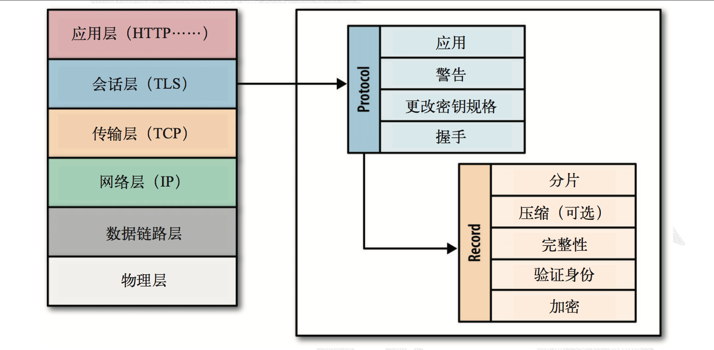
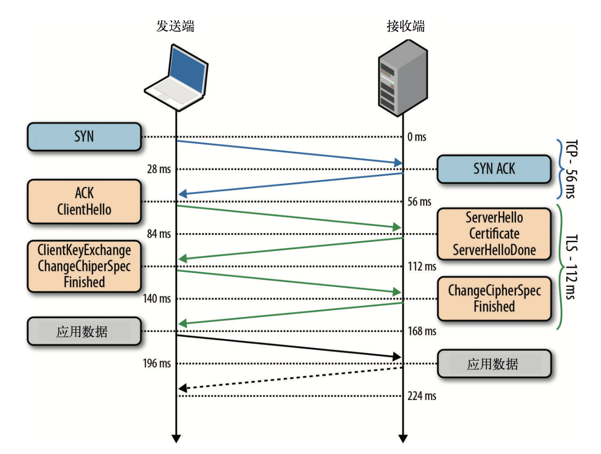
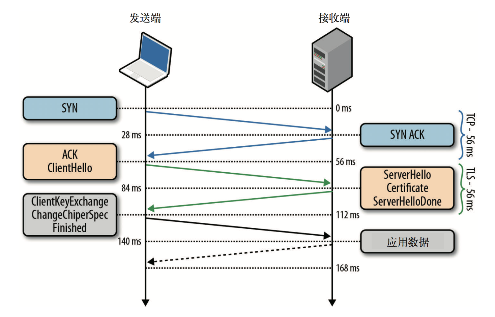
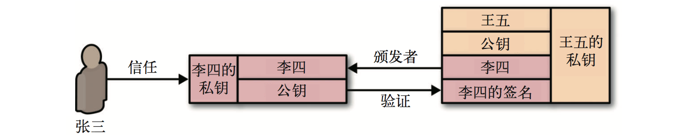
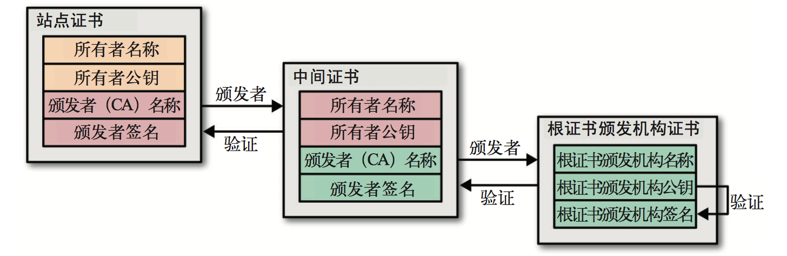
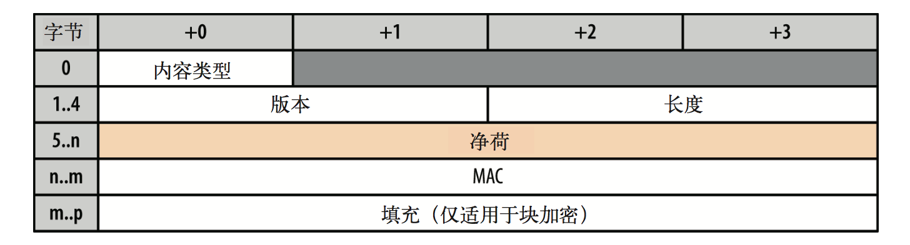

*本文大部分内容整理自《Web性能权威指南》，仅供学习所用。*

## 1. 什么是TLS
SSL(SecureSocketsLayer，安全套接字层)协议最初是网景公司为了保障网上交易安全而开发的，该协议通过加密来保护客户个人资料，通过认证和完整性检查来确保交易安全。为达到这个目标，SSL协议在直接位于TCP上一层的应用层被实现(如下图)。SSL不会影响上层协议(如HTTP、电子邮件、即时通讯)，但能够保证上层协议的网络通信安全。

SSL2.0是该协议第一个公开发布的版本，但由于存在很多安全缺陷很快就被SSL3.0取代。鉴于SSL协议是网景公司专有的，IETF成立了一个小组负责标准化该协议，后来就有了RFC2246，即TLS1.0，也就是SSL3.0的升级版。**TLS包含两部分：握手协议、记录协议**。

## 2. TLS握手协议

### 2.1 一般握手
客户端与服务器在通过TLS交换数据之前，必须协商建立加密信道。协商内容包括TLS版本、加密套件，必要时还会验证证书。然而，协商过程的每一步都需要一个分组在客户端和服务器之间往返一次(如下图)，因而所有TLS连接启动时都要经历一定的延迟（最多需要两次额外往返）。

- 0ms : TLS在可靠的传输层(TCP)之上运行，这意味着首先必须完成TCP的“三次握手”，即一次完整的往返。
- 56ms : TCP连接建立之后，客户端再以纯文本形式发送一些规格说明，比如它所运行的TLS协议的版本、它所支持的加密套件列表，以及它支持或希望使用的另外一些TLS选项。
- 84ms : 然后，服务器取得TLS协议版本以备将来通信使用，从客户端提供的加密套件列表中选择一个，再附上自己的证书，将响应发送回客户端。作为可选项，服务器也可以发送一个请求，要求客户端提供证书以及其他TLS扩展参数。
- 112ms : 假设两端经过协商确定了共同的版本和加密套件，客户端也高高兴兴地把自己的证书提供给了服务器。然后，客户端会生成一个新的对称密钥，用服务器的公钥来加密，加密后发送给服务器，告诉服务器可以开始加密通信了。到目前为止，除了用服务器公钥加密的新对称密钥之外，所有数据都以明文形式发送。
- 140ms : 最后，服务器解密出客户端发来的对称密钥，通过验证消息的MAC检测消息完整性，再返回给客户端一个加密的“Finished”消息。
- 168ms : 客户端用它之前生成的对称密钥解密这条消息，验证MAC，如果一切顺利，则建立信道并开始发送应用数据。
 
> 公钥加密系统(http://en.wikipedia.org/wiki/Public-key_cryptography)只在建立TLS信道的会话中使用。在此期间，服务器向客户端提供它的公钥，客户端生成对称 密钥并使用服务器的公钥对其加密，然后再将加密的对称密钥返回服务器。服务器继而用自己的私钥解密出客户端发来的对称密钥。接下来，客户端与服务器间的通信就全都使用客户端生成的共享密钥加密，这就是对称密钥加密。之所以这样设计，很大程度上是出于性能考虑，因为公钥加密需要很大的计算量。为了演示两者的差别，假如你的电脑上安装了 OpenSSL，可以试试以下两条命令:`openssl speed rsa`、`openssl speed aes`。

### 2.2 TLS会话恢复（简短握手）

#### 2.2.1 会话标识符
从上面我们可以知道一次握手需要两次额外的往返时间，为了挽回这些损失，TLS提供了恢复功能，即在多个连接间共享协商后的安全密钥。即，服务器创建32字节的会话标识符，并在上一节我们讨论的完整的TLS协商期间作为其“ServerHello”消息的一部分发送。**借助会话标识符可以节省一次往返（参见下图），还可以省掉用于协商共享加密密钥的公钥加密计算**。

#### 2.2.2 会话记录单
由于服务器必须为每个客户端都创建和维护一段会话缓存，这样的话，请求量大的服务器就需要维护大量的会话ID，并且还要指定一个高效的缓存、清除策略。为了解决这个问题，**会话记录单**应运而生，即，**服务器可以在完整TLS握手的最后一次交换中添加一条“新会话记录单”(New Session Ticket)记录，包含只有服务器知道的安 全密钥加密过的所有会话数据。
然后，客户端将这个会话记录单保存起来，在后续会话的 ClientHello 消息中，以将其包含在SessionTicket扩展中。这样，所有会话数据只保存在客户端，而由于数据被加密过，且密钥只有服务器知道，因此仍然是安全的。**

### 2.3 证书链
身份验证是建立每个TLS连接必不可少的部分。毕竟，加密信道两端可以是任何机 器，包括攻击者的机器。为此，必须确保我们与之交谈的计算机是可信任的，否则 之前的工作都是徒劳。为理解如何验证通信两端的身份，下面我们以张三和李四之间的验证为例简单说明一下:

- 张三和李四分别生成自己的公钥和私钥;
- 张三和李四分别隐藏自己的私钥;
- 张三向李四公开自己的公钥，李四也向张三公开自己的公钥; - 张三向李四发送一条新消息，并用自己的私钥签名;
- 李四使用张三的公钥验证收到的消息签名。

信任是上述交流的关键。公钥加密可以让我们使用发送端的公钥验证消息是否使用了正确的私钥签名，但认可发送端仍然是基于信任。在上述交流中，张三和李四可以当面交换自己的公钥，因为他们互相认识，能够保证不被别人冒名顶替。可以说，他们已经通过之前安全(物理)的握手确认了对方。

接下来，张三收到王五发来的一条消息。张三从未见过王五，但王五自称是李四的朋友。事实上，为了证明自己是李四的朋友，王五还请李四用李四的私钥签署了自己的公钥，并在消息中附上了签名(见下图)。此时，张三首先检查王五公钥中李四 的签名。他知道李四的公钥，因而可以验证李四确实签署了王五的公钥。由于他信任李四对王五的签名，所以就接受了王五的消息，并对消息进行完整性检查，以确保消息确实来自王五。刚才这个过程建立了一个信任链:张三信任李四，李四信任王五，通过信任的传递，张三信任王五。只要这条链上的人不会被冒名顶替，我们就可以继续扩展这个信任网络。

TLS的证书验证就跟上面的例子类似。只不过类似李四这样的中间人（中间证书）很多，这些证书是一级一级网上验证，直到根证书（一般浏览器内置了几百个可信任的根证书）。证书颁发机构签署数字证书如下图。

证书颁发过程：

- 根证书颁发中间证书。
- 中间证书颁发站点证书。

证书验证过程：

- 从站点证书出发一直往上找到根证书。
- 根证书验证中间证书。
- 中间证书验证站点证书。

## 3. TLS记录协议

与位于其下的IP或TCP层没有什么不同，TLS会话中交换的所有数据同样使用规格明确的协议进行分帧(如下图)。TLS记录协议负责识别不同的消息类型(握手、警告或数据，通过“内容类型”字段)，以及每条消息的安全和完整性验证。

交付应用数据的典型流程如下：

- 记录协议接收应用数据。
- 接收到的数据被切分为块:最大为每条记录214字节，即 16 KB。
- 压缩应用数据(可选)。
- 添加MAC(Message Authentication Code)或HMAC。
- 使用商定的加密套件加密数据。

以上几步完成后，加密数据就会被交给TCP层传输。接收端的流程相同，顺序相反:使用商定的加密套件解密数据、验证 MAC、提取并把数据转交给上层的应用。
同样，值得庆幸的是以上过程都由TLS层帮我们处理，而且对大多数应用都是完全透明的。不过，记录协议也带来了一些重要的限制，务必要注意:

- TLS记录最大为16KB;
- 每条记录包含5字节的首部、MAC(在 SSL 3.0、TLS 1.0、TLS 1.1 中最多 20 字节，
在 TLS 1.2 中最多 32 字节)，如果使用块加密则还有填充;
- 必须接收到整条记录才能开始解密和验证。

有可能的话，应该自主选择记录大小，这也是一项重要的优化。小记录会因记录分帧而招致较大开销，大记录在被TLS层处理并交付应用之前，必须通过TCP传输和重新组装。

## 4. TLS性能检查清单
- 要最大限制提升TCP性能;
- 把TLS库升级到最新版本，在此基础上构建(或重新构建)服务器;
- 启用并配置会话缓存和无状态恢复;
- 监控会话缓存的使用情况并作出相应调整;
- 在接近用户的地方完成TLS会话，尽量减少往返延迟;
- 配置TLS记录大小，使其恰好能封装在一个TCP段内;
- 确保证书链不会超过拥塞窗口的大小;
- 从信任链中去掉不必要的证书，减少链条层次;
- 禁用服务器的TLS压缩功能;
- 启用服务器对SNI 的支持;
- 启用服务器的OCSP封套功能;
- 追加HTTP严格传输安全首部。

> 要验证和测试你的配置，可以使用 Qualys SSL Server Test(https://www. ssllabs.com/ssltest/)等在线服务来扫描你的服务器，以发现常见的配置和安全漏洞。也可以通过`openssl s_client -state -CAfile startssl.ca.crt -connect igvita.com:443`来检查整个握手和本地服务器配置情况。

