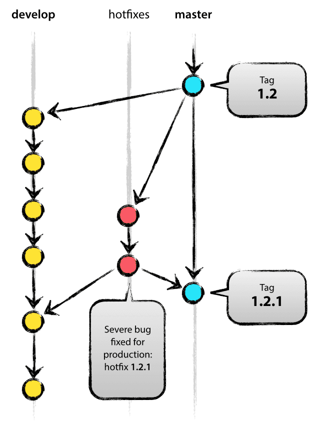

# 前言
为了提高团队的开发效率以及质量，团队成员共同准守一个简单实用的git开发流是十分有必要的，参考文章[A successful Git branching model](http://nvie.com/posts/a-successful-git-branching-model)和[Gerrit官方文档](https://gerrit-documentation.storage.googleapis.com/Documentation/2.14/index.html)以及个人的开发经验，总结出了以下内容。

# Git工作流

## 简述
整个开发过程中我们一般会涉及以下这几个类型的分支：

- **master分支**：永久存在远端的主干分支。
- **develop分支**：永久存在远端的开发分支。
	- **feature分支**：从**develop分支**拉出来的仅存在本地的开发分支。
	- **release分支**：从**develop分支**拉出来的开发分支。当一个版本未发布，另一个版本又在开发，那么该分支有必要存在。
- **hotfix分支**：从**master分支**拉出来的紧急bug修复的分支。

详细的介绍请往下看。

## master和develop分支（两条永久存在的远程分支）
当我们新建一个git项目时，有一条默认的分支，即**master分支**，同时我们还应手动创建一个**develop分支**。这两条分支的关系如下图：


这两个分支的功能如下：

- **master分支**：是项目的主干分支，是一条**最稳定**的分支，意味着开发工程中**尽量不要改动该分支**。基本上就是在项目**初始化**、**打tag**、以及**紧急bug修复**的时候会切换到该分支。开发过程中一般不会切换到该分支，如果要更改**master**分支的代码，**还请三思**。

- **develop分支**：这是一条从**master**分支拉出来的分支，这条分支的生命周期跟随整个项目。一般情况下所有的**feature分支**都应该从这条分支拉出去的。


## 从develop分支拉出去的两条分支

### feature分支（仅存在本地的分支）

为了便于特性的管理以及减少开发过程中与其他成员代码的冲突，建议在每开发一个新特性的时候都应该对应的从**develop分支**拉出来一条**feature分支**，然后在这个**feature分支**进行开发。开发完成后，将**feature分支**功能合并回到**develop分支**，然后就可以将本地**feature分支**删掉了。**feature分支**与**develop分支**的关系如下图：


关于**feature分支**的涉及的`git`命令包含但不仅限于如下：

- 从**develop分支**拉出来一条**feature分支**：

	```
	git checkout -b myfeature develop
	```
- 将**feature分支**功能合并回到**develop分支**：

	```
	$ git checkout develop
	Switched to branch 'develop'
	$ git merge --no-ff myfeature               ##关于--no-ff的作用，后面会有介绍
	Updating ea1b82a..05e9557
	(Summary of changes)
	$ git branch -d myfeature
	Deleted branch myfeature (was 05e9557).
	$ git push origin develop
	```


> 注意：如果开发过程中，需要依赖其他成员的开发的特性，应先让该成员合并起特性到**develop分支**，然后自己再把**develop分支**`rebase`回自己的**feature分支**。

### release分支
也是一条从**develop分支**拉出来的分支，主要的应用场景类似于：1.0版本还未发布，1.1版本又需要同步开发。这时候就需要从**develop分支**拉出来一条`release-1.0`分支，然后所有的测试、bug修复都在这条分支上处理。等稳定以后，需要将`release-1.0`合并回**master分支**并**打上tag**，同时也需将其合并到**develop分支**，如有冲突必须解决冲突。这整个过程一般如下：

1. 从**develop分支**拉出来一条`release-1.0`分支。

	```
	$ git checkout -b release-1.0 develop
	Switched to a new branch "release-1.0"
	```

2. 将`release-1.0`合并回**master分支**并**打上tag**。
	
	```
	$ git checkout master
	Switched to branch 'master'
	$ git merge --no-ff release-1.2
	Merge made by recursive.
	(Summary of changes)
	$ git tag -a 1.2
	```

3. 将`release-1.0`合并到**develop分支**,如果有冲突必须解决冲突。

	```
	$ git checkout develop
	Switched to branch 'develop'
	$ git merge --no-ff release-1.2
	Merge made by recursive.
	(Summary of changes)
	```
4. 删除`release-1.0`分支。

	```
	$ git branch -d release-1.2
	Deleted branch release-1.2 (was ff452fe).
	```


### merge的两种形式
如下图所示，merge的时候加`--no-ff`参数的区别在于：

- 有`--no-ff`参数：当合并回**develop分支**的时候，会创建一个新的`commit`，这个`commit`就相当于将上次合并之后的本**feature分支**的所有`commit`打包了。
- 无`--no-ff`参数：当合并回**develop分支**的时候，不会创建新的`commit`。


## hotfix分支
版本发布之后，存在严重bug需要紧急处理的时候，就需要从**master分支**拉出一条**hotfix分支**，然后在这条分支上修复bug，验证通过后，将其合并回**master分支**以及**develop分支**。



过程一般如下：

1. 从**master分支**拉出一条**hotfix分支**。

	```
	$ git checkout -b hotfix-1.2.1 master
	Switched to a new branch "hotfix-1.2.1"
	```
	
2. 修复bug，提交修改。

	```
	$ git commit -m "Fixed severe production problem"
	[hotfix-1.2.1 abbe5d6] Fixed severe production problem
	5 files changed, 32 insertions(+), 17 deletions(-)
	```
	
3. 验证通过合并回**master分支**。

	```
	$ git checkout master
	Switched to branch 'master'
	$ git merge --no-ff hotfix-1.2.1
	Merge made by recursive.
	(Summary of changes)
	$ git tag -a 1.2.1
	```
	
4. 合并回**develop分支**。

	```
	$ git checkout develop
	Switched to branch 'develop'
	$ git merge --no-ff hotfix-1.2.1
	Merge made by recursive.
	(Summary of changes)
	```
5. push到远端。

## 小结
按照如上的git工作流，基本上能解决团队合作开发的问题，但是为了能提高代码的质量，可以引入**code review**机制，即每个提交都需要经过相关人员审核才能合入远程的分支或者主干。这个工作可以人工管理，也可以采用一些现成的工具，**Gerrit**就是这么一个带有评审机制的git服务，下面就对其进行简单介绍。

# Gerrit简述

## 简述
**Gerrit**，是一个基于SSH协议实现的一套Git服务器，也是Android项目使用的评审服务器。利用网页浏览器，同一个团队的软件程序员，可以相互审阅彼此修改后的代码，决定是否能够提交，退回或是继续修改。详细介绍可参见[维基百科](https://zh.wikipedia.org/zh-cn/Gerrit)或者更加全面的了解Gerrit[官方文档](https://gerrit-documentation.storage.googleapis.com/Documentation/2.14/index.html)无疑是最好的资料。

## Gerrit审核工作流


从上图我们可以看出当我们提交代码到Gerrit服务器的时候，并不会直接合并代码到源库中，而是会存储在一个缓冲区中，等待审查者和检验者的评审，通过后方能合并到源代码库中。当然，Gerrit也可以关闭审核流程，但这并不是我们想要的。整个评审流程请参见下图：


## Gerrit的实际操作

- 首先登陆Gerrit web端，切换到自己的项目，然后选择“Clone with commit-msg hook”，复制后黏贴到终端将项目拷贝到本地。如下图：


> 提示：一定要选择“Clone with commit-msg hook”选项卡，这样的话，会将Gerrit的`commit-msg hook`自动加入到你的`Your proj/.git/hooks/`目录下，否则后面的提交可能会出现[missing Change-Id in commit message footer](https://gerrit-documentation.storage.googleapis.com/Documentation/2.14/error-missing-changeid.html)错误。

- 开发完后，如需推送本地代码到远端评审，在终端输入下面命令也可以使用[git-review](https://github.com/openstack-infra/git-review/)，请留意与**普通push**的区别。

```
➜  HelloGerrit git:(develop) git push origin HEAD:refs/for/develop
Counting objects: 3, done.
Delta compression using up to 8 threads.
Compressing objects: 100% (3/3), done.
Writing objects: 100% (3/3), 354 bytes | 0 bytes/s, done.
Total 3 (delta 0), reused 0 (delta 0)
remote: Processing changes: new: 1, refs: 1, done
remote:
remote: New Changes:
remote:   http://szrd.phiwifi.com:8080/12 test1.txt
remote:
To ssh://szrd.phiwifi.com:29418/HelloGerrit
 * [new branch]      HEAD -> refs/for/develop
```

- 相关的审核人员登录Gerrit->All->List->Open，找到相应的条目进行评审，如下图:


- 具体的评审页面介绍请参见官方介绍[Review UI](https://gerrit-documentation.storage.googleapis.com/Documentation/2.14/user-review-ui.html)。

## 小结
对于团队中单个开发者来说，使用**Gerrit**与普通的**git**工作的主要区别主要有以下两点，只要注意这两点，然后在实际开发中多操作、多交流，就不会有太大问题。

- 需要将**Gerrit**的`commit-msg hook`导入到本地git工作目录中，这一步可以自动完成。
- push的时候应该push到`refs/for/*`分支中，普通的git是push到`refs/heads/*`中。

# 总结
通过上面的介绍，引入Gerrit后的git工作流的基本操作一般如下：

1. 建立项目后，在远端建立两条永久分支：**master分支**（自动创建）和**develop分支**（手动创建）。
2. 开始开发，每个成员从**develop分支**拉出自己的**feature分支**进行开发。
3. 成员完成功能后，将自己的**feature分支**合并回**develop分支**。
 	> push的时候注意：`push origin HEAD:refs/for/develop`。
 	
4. 所有功能完成后，进入测试阶段，如果有并行的版本同时进行，应从**develop分支**拉出一条**release分支**，然后在该分支中进行测试、修复bug，直到稳定。
5. 发布版本之前，如有**release分支**，将其合并回**develop分支**以及合并到**master分支**，如果没有**release分支**，则将**develop分支**合并到**master分支**，然后进行测试验证，验证通过后，可将**release分支**删除，最后将**develop分支**和**master分支**push到远端。
	> push的时候注意：`push origin HEAD:refs/for/develop`或者`push origin HEAD:refs/for/master`。
6. 发布版本时，在**master分支**打上相应的**tag**。
7. 如有紧急bug需要处理，从**master分支**拉出来一个**hotfix分支**，然后在这个分支修复、验证，通过之后合并回**master分支**和**develop分支**，在**master分支**上打上**tag**，可将**hotfix分支**删除，最后将**master分支**和**develop分支**push到远端。
   > push的时候注意：`push origin HEAD:refs/for/develop`或者`push origin HEAD:refs/for/master`。

上面流程都是评审一切顺利的过程，如果push到远端的提交没有被通过，则需要重新修改后再提交，反复如是，直到通过。这个过程中由于引入了Gerrit，凡是涉及到push操作，都应注意将其push到`refs/for/*`下。


### 参考文献
- [Gerrit Code Review for Git](https://gerrit-documentation.storage.googleapis.com/Documentation/2.14/index.html)
- [Gerrit 代码审核服务器的工作流和原理](http://www.worldhello.net/2010/11/10/2059.html)
- [A successful Git branching model](http://nvie.com/posts/a-successful-git-branching-model/)