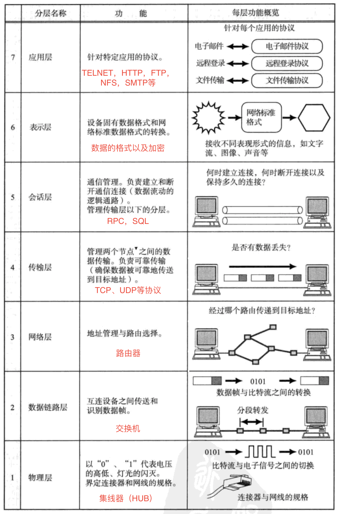
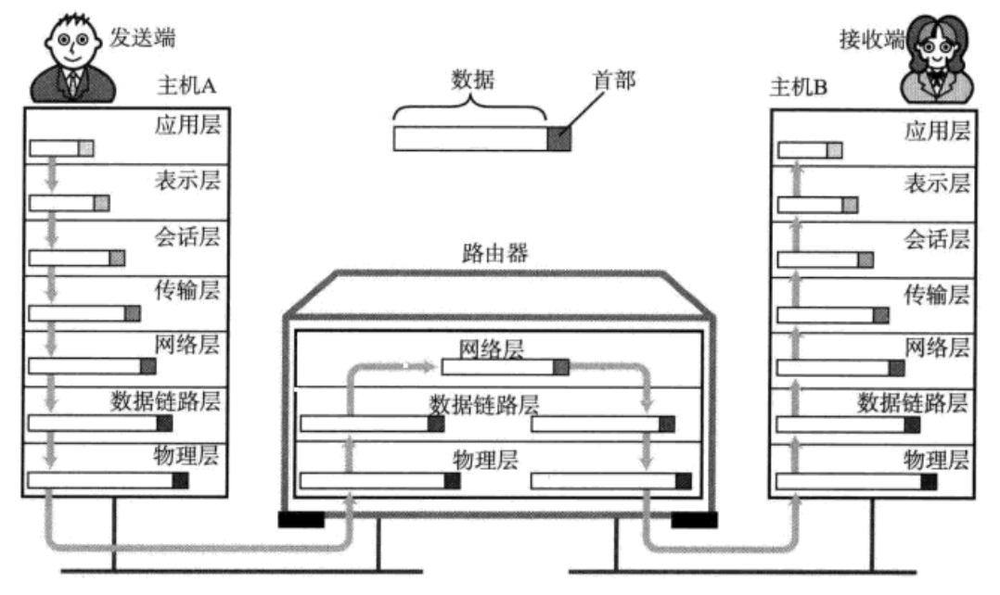

## HUB（物理层）
- 工作在OSI参考模型的**物理层**。
- 提供数据转发的功能。
- 分类：
	- **无源HUB**：发不对信号做任何的处理，只做简单的数据转发，对介质的传输距离没有扩展，并且对信号有一定的影响。
	- **有源HUB**：除了数据转发外，还提供信号放大或再生的功能，这样它就延长了两台主机间的有效传输距离。
	- **智能HUB**：除具备有源HUB所有的功能外，还有网络管理及路由功能。

## 交换机（数据链路层）
- 工作在OSI参考模型的**数据链路层**。
- 交换机内部的CPU会在每个端口成功连接时，通过将MAC地址和端口对应，形成一张MAC表。在今后的通讯中，发往该MAC地址的数据包将仅送往其对应的端口，而不是所有的端口。因此，交换机可用于划分数据链路层广播，即冲突域；但它不能划分网络层广播，即广播域。

## 路由器（网络层）
- 工作在OSI参考模型的**网络层**。
- 路由器（Router）又称网关设备（Gateway）是用于连接多个逻辑上分开的网络，所谓逻辑网络是代表一个单独的网络或者一个子网。当数据从一个子网传输到另一个子网时，可通过路由器的路由功能来完成。因此，路由器具有判断网络地址和选择IP路径的功能，它能在多网络互联环境中，建立灵活的连接，可用完全不同的数据分组和介质访问方法连接各种子网，路由器只接受源站或其他路由器的信息，属网络层的一种互联设备。

## 网络传输与OSI七层网络协议
- OSI七层网络协议对应的功能。

- 一个网络数据传输的例子
